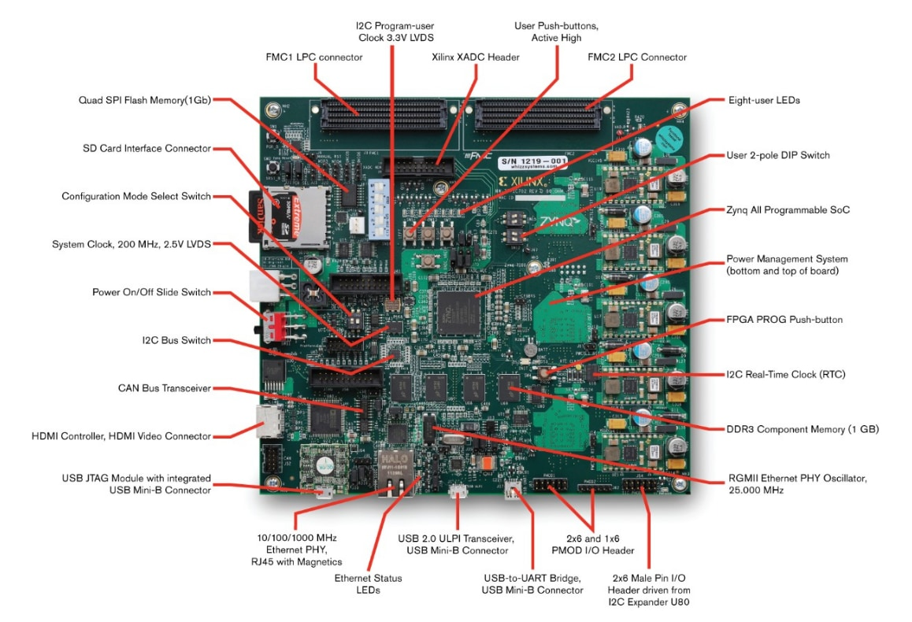
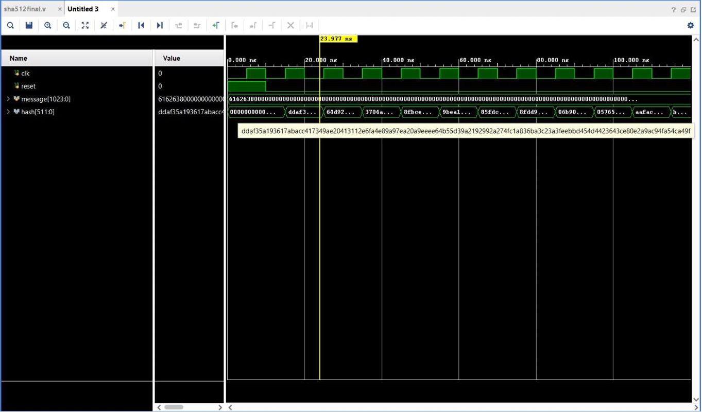

# SHA-512-Algorithm-
# SHA-512 Cryptographic Hardware Accelerator (RTL Design)

> A fully pipelined SHA-512 cryptographic hash function core designed in Verilog HDL, optimized for high-throughput data compression and synthesized for the AMD Zynq™ 7000 SoC architecture.

## Objective
Software-based cryptographic hashing introduces high latency and CPU overhead. This project implements a dedicated hardware accelerator for the SHA-512 algorithm (NIST FIPS 180-4). By leveraging low-level hardware logic (shifts, rotations, and bitwise operations) within a pipelined architecture, the design offloads heavy computation from the main processor, significantly improving throughput and timing closure.

## Technical Documentation
For a detailed breakdown of the Verilog implementation, message scheduling, and the 80-round compression architecture, please review the [SHA-512 Hardware Implementation Report](SHA_512_Hardware_report.pdf).

## NDA & Implementation Notice
*Please Note: This project was developed during an internship at the Strategic Electronics Division (SED) of Electronics Corporation of India Limited (ECIL). Due to confidentiality agreements and NDA restrictions, the physical bitstream, Integrated Logic Analyzer (ILA) debugging setups, and specific ZC702 board constraint files (.xdc) have been omitted from this public repository. This repository contains the core RTL logic and simulation testbenches used for functional verification.*

## Tech Stack & Architecture
* **Hardware Target:** AMD Zynq™ 7000 SoC ZC702 Evaluation Kit
* 
* **Language:** Verilog HDL
* **EDA Tools:** Xilinx Vivado (Synthesis, Simulation, RTL Analysis)
* **Core Logic:** 80-round compression pipeline, 1024-bit message scheduling, 64-bit internal state variables.

## RTL Verification & Simulation
To verify architectural intent and ensure functional correctness prior to silicon deployment, exhaustive simulation was performed using Vivado's simulation toolsuite. 
* **Testbench Methodology:** An automated testbench (`sha512_tb.v`) was engineered to feed padded 1024-bit input blocks into the datapath.
* **Correlation:** Simulated 512-bit hash outputs were successfully correlated against standard NIST test vectors to ensure absolute precision in the compression unit.

## 📈 Simulation Waveforms

## Repository Structure
* [`sha512final.v`](sha512final.v): The core RTL datapath, containing the logic for message expansion, constant initialization, and the 80-round compression function.
* [`sha512_tb.v`](sha512_tb.v): The verification testbench used to drive clock signals, supply padded input vectors, and validate the resulting 512-bit hash.
